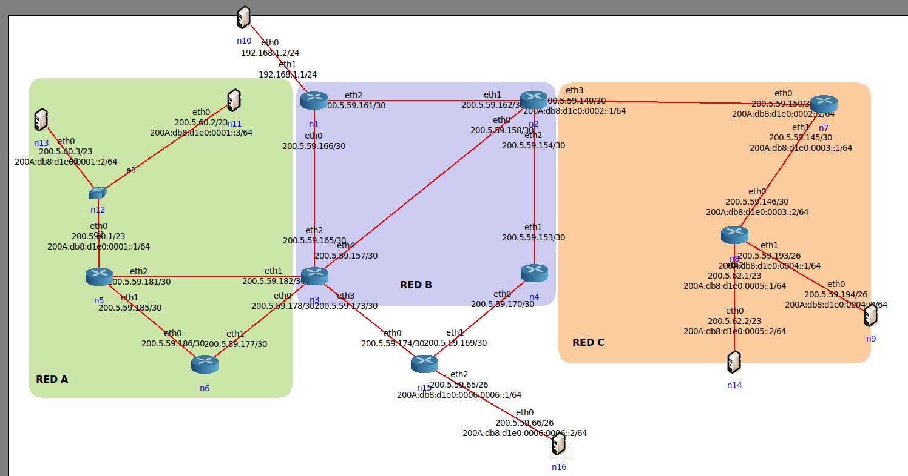

# Ejercicio 10 de la Práctica 3 complementaria
# 200.5.48.0/20; 200A:db8:d1e0::/48

## Al ejercicio presentado en la práctica 3 agregar una red con 40 hosts detrás del router n15. La misma debe soportar IPv6 e IPv4. Para IPv6 activar en el router los RA y entregar RDNSS. Capturar tráfico y analizar. Comparar con los mensajes DHCP. Comparar la funcionalidad del SLAAC con los RA y DHCPv6. Alternativo: activar DHCPv6 en la red.

### Red n15 de 40 hosts

Recordando las direcciones disponibles del Ejercicio 12 de la práctica 3:

`200.5.48.0` hasta `200.5.59.143` quedan libres para seguir subneteando.

200.5.59.143 -> Red de la cual partimos.

11001000.00000101.00111011.10001111 -> red expresada en bits

11001000.00000101.00111011.10|**00 0000**| -> Colocamos en cero los bits que necesitamos para hosts.

11001000.00000101.0011|**1011.10**|00 0000 -> Bits tomados para subred.

La nueva máscara de subred será /26

200.5.59.128/26 -> La red choca con las direcciones que hemos asignado con los enlaces punto a punto

Entonces elegimos el próximo bloque de direcciones disponible

11001000.00000101.0011|**1011.01**|00 0000 -> Próxima red disponible para los 40 hosts.

**200.5.59.64/26** -> **Dirección IP asignada para la red n15**

Finalmente las direcciones `200.5.48.0` a `200.5.59.63` quedan libres para seguir subneteando.

### Direcciones IPv6 asignadas con el bloque asignado 200A:db8:d1e0::/48

Para la red de n15, asignamos una nueva subred /64 del próximo bloque contiguo asignable, recordando el tp3:

**Red ipv6 Asignada n15: 200A:db8:d1e0:0006::/64**

---

### Asignación de direcciones a cada host de la red n15

---

### Activar los RA dentro de n15

Se realizó la siguiente secuencia.

Primero en una terminal de linux fuera de la herramienta CORE instalamos: `sudo apt install radvd`

Luego dentro del servicio "Static Route" colocamos lo siguiente: `radvd -n -d 2 -C /etc/radvd.conf`

Finalmente con el comando `ip address show` en la terminal del host n16 observaremos la siguiente línea:

Esto significa que la dirección pudo configurarse automáticamente con el RA de su gateway, por lo tanto está funcionando correctamente.
