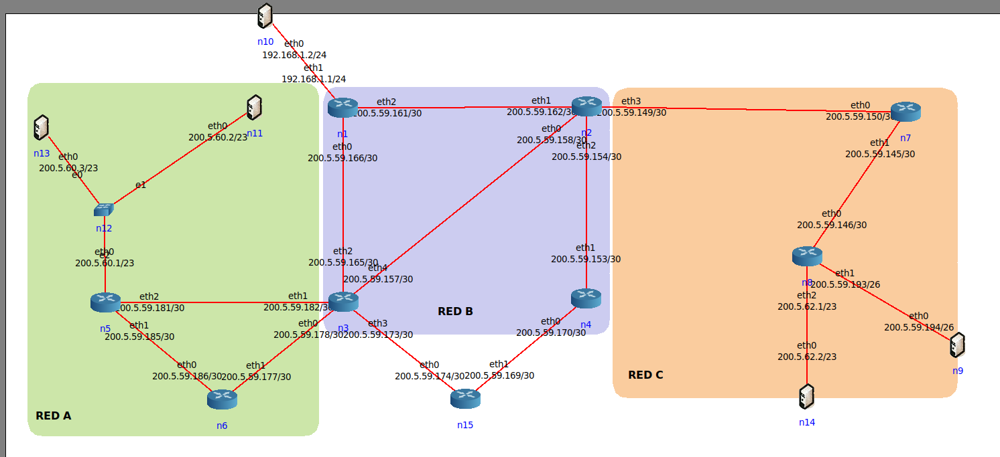
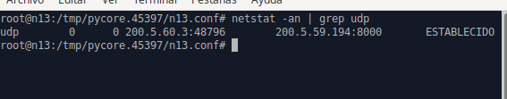
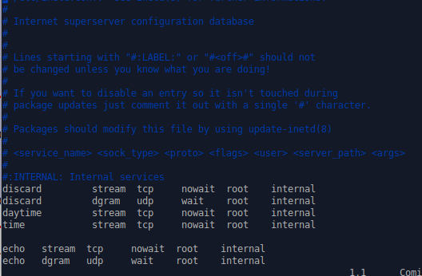
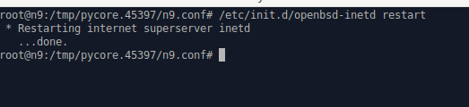
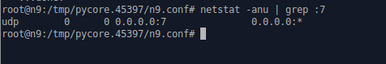
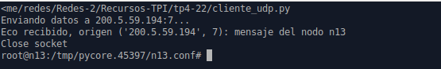
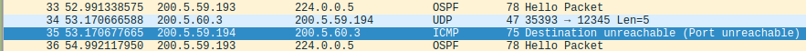
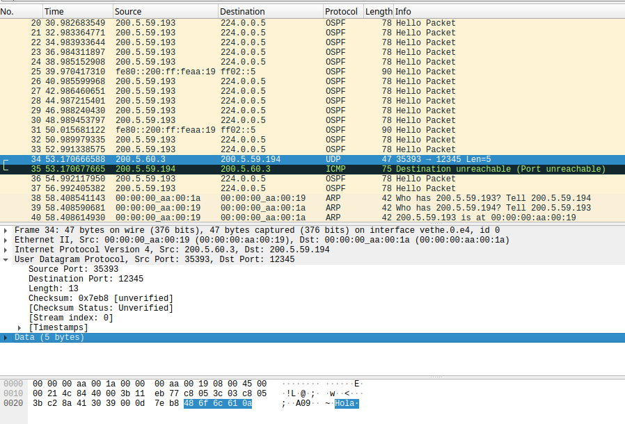
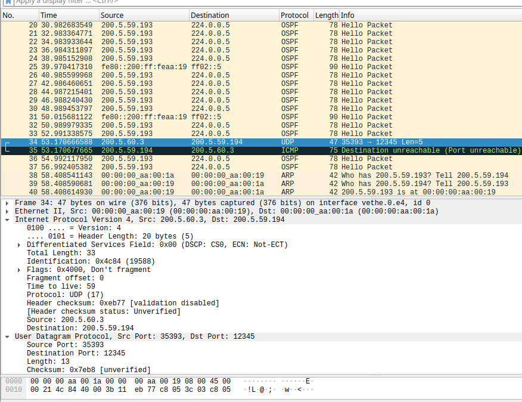
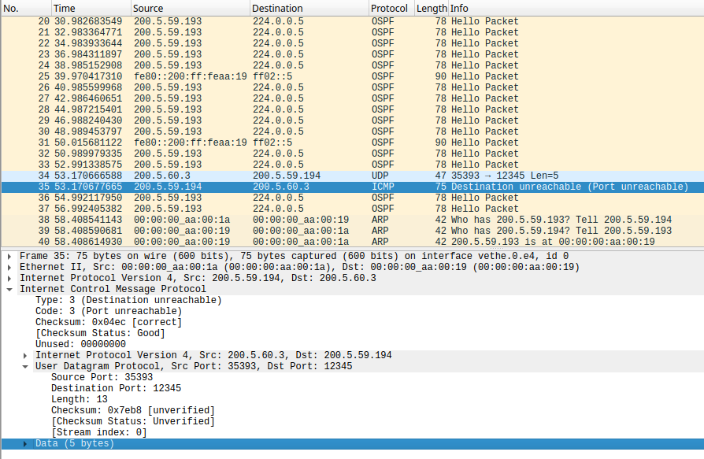

# Ejercicio 22 de la Práctica 4

## Levantar un servicio UDP con la herramienta nc (netcat) en el host n9 y enviar información desde n13 usando el mismo comando. Ver el estado de los sockets en ambos extremos. ¿Qué significa el estado ESTABLISHED en UDP?

Partimos de la topología de la figura 6 del tp3

Se inicia la topología y se ejecutan los siguientes comandos

### Host n9
- `nc -u -l 8000`
    - u: UDP
    - l: Listen (escuchar)

### Host n13
- `nc -u <IP_de_n9> 8000`

Abrimos otra terminal dentro de este host para verificar la conectividad (Esto puede hacerse en una terminal nueva de cualquiera de los host involucrados)

Ejecutamos:
- `netstat -an | grep udp`

Se observa que la conexión se ha establecido correctamente (estado ESTABLECIDO)

###  ¿Qué significa el estado ESTABLISHED en UDP?

En UDP, el estado ESTABLISHED (o ESTABLECIDO) es un estado lógico local del sistema operativo y no del protocolo de red. Significa que el socket ha sido configurado para enviar y recibir datos únicamente desde una dirección remota específica, aunque no exista una sesión real ni intercambio de paquetes de negociación (handshake) en la red.

En UDP, ESTABLISHED no indica una conexión como en TCP, es un **estado lógico del SO**, este lo registra un intercambio reciente de datagramas UDP entre dos extremos, pero sin conexión real, solo para fines de seguimiento interno, esto es, el **socket** ha sido **configurado para enviar y recibir datos únicamente desde una dirección remota específica**, aunque **no exista una sesión real ni intercambio de paquetes de negociación** (handshake) en la red.
---

## Levantar en el super daemon inetd o similar con el servicio UDP echo y probar con un cliente programado en el lenguaje de su elección mediante la API socket contra este servicio. Inspeccionar el estado. Ver de generar datos hacia el “servidor” desde más de un Nodo.

Primero, se intaló "inetd" dentro de una terminal de linux, fuera de la herramienta CORE

`sudo apt install openbsd-inetd`

Luego se realizan las siguientes configuraciones:

### Host n9
- `vim /etc/inetd.conf` -> Verificamos el archivo
Veremos una serie de servicios que nos provee inetd, debemos descomentar los que queremos utilizar:
    - `echo   dgram   udp     wait    root    internal` -> nos aseguramos que esta línea esté descomentada
- `/etc/init.d/openbsd-inetd restart` -> iniciar el servicio
- `netstat -anu | grep :7` -> verificamos que está funcionando

Podemos ver que el servicio está activo, en el puerto 7 (el default para el echo)

### Host n11 y n13
Se realizó el script de python "**cliente_udp.py**"

- `python3 <ubicación del script>/cliente_udp.py` -> ejecutamos en una terminal de cada host

Vemos que la conexión e intercambio se realiza con éxito.

---

## Enviar información desde n13 a n9 a un port UDP donde no existe un proceso esperando por recibir datos. ¿Cómo notifica el stack TCP/IP de este hecho? Investigue la herramienta traceroute que ports utiliza y cómo usa estos mensajes (Ver ejercicio de IP con ruteo estático).

Realizamos los pasos similares al inciso anterior, sólo que esta vez le indicamos un puerto aleatorio al host n13:

### Host n13
- `echo "Hola?" | nc -u -w 1 46.90.19.194 12345`
- También podíamos hacerlo cambiando el puerto en la variable "PUERTO" dentro del script "**cliente_udp.py**"

El stack TCP/IP notifica el evento mediante un mensaje ICMP “Destination Unreachable – Port Unreachable”.

La herramienta traceroute utiliza este comportamiento enviando paquetes UDP a puertos altos, en los que no hay servicio escuchando; los routers intermedios responden con ICMP “Time Exceeded”, y el destino final responde con “Port Unreachable”, lo que permite justamente identificar la ruta completa.
---

## Para las pruebas anteriores capturar tráfico y ver el formato de los datagramas UDP y como se encapsulan en IP

Realizando nuevamente las pruebas anteriores, enviando un echo desde n13 a n9, y capturando el tráfico con wireshark:

Se observa que el **datagrama UDP** está formado por un encabezado de 8 bytes, y un payload con los datos.
El encabezado contiene los campos:
 - Source Port 
 - Destination Port 
 - Length
 - Checksum
El payload se muestra como Data, y contiene los datos transportados.
El datagrama entero **es encapsulado dentro de un paquete IPv4**, identificado por el campo Protocol = 17.
Luego, al enviarse el datagrama a un puerto sin servicio, el host destino responde con un mensaje **ICMP** “Destination Unreachable – Port Unreachable”, el cual contiene los primeros 8 bytes del payload original (en este caso contiene el datagrama UDP con error) y **también se encuentra encapsulado dentro de IP**.