# Ejercicio 23 de la Práctica 4

## a) Programar en el lenguaje de su elección mediante la API socket un servidor TCP que escuche conexiones en el puerto 9000 y que los datos que reciba los descarte. Correr en el nodo n9 y enviar datos desde otro nodo usando la herramienta nc (netcat) o telnet.

Realizamos el script [Servidor TCP](../../Recursos-TPI/tp4-23/servidor_descartador.py) con la API socket, utilizando python.
y ejecutamos lo siguiente en cada host:

### Host n9
- `python3 <ubicación del script>/servidor_descartador.py` -> ejecuta el script, crea el servidor y comienza a escuchar

### Host n13
- `nc <IP_de_n9> 9000` -> se configura la conexión TCP por defecto hacia el puerto 9000

Prueba de conexión:
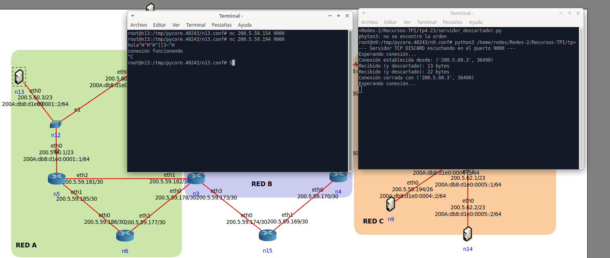

La conexión se establece, se descartan los datos, y luego se cierra correctamente para continuar esperando.

---

## b) En el nodo n9 levantar con el super daemon inetd algunos servicios extras, como tcp echo, discard y otros. Chequear los servicios TCP y UDP activos.

### Host n9
Ejecutamos lo siguiente:
- `vim /etc/inetd.conf` -> abrimos el archivo y editamos en modo insert (i):
    - `echo     dgram   udp     wait    root    internal` -> descomentamos, devuelve lo que recibe
    - `discard  stream  tcp     nowait  root    internal` -> descomentamos, descarta lo que recibe
    - `daytime  stream  tcp     nowait  root    internal` -> descomentamos, devuelve fecha y hora en ASCII
    - `time  stream  tcp     nowait  root    internal`

Luego guardamos y salimos -> :wq
    stream: socket orienetado a conexión
    dgram: socket de mensajes

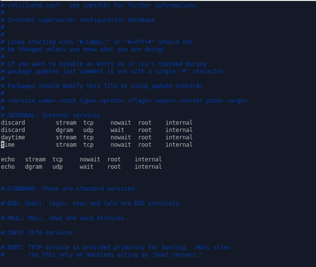

Luego ejecutamos:
- `/etc/init.d/openbsd-inetd restart` -> iniciar el servicio
- `netstat -ant` -> verificamos que está escuchando los puertos 7 (echo), 9(discard), 13(daytime) y 37 (time)

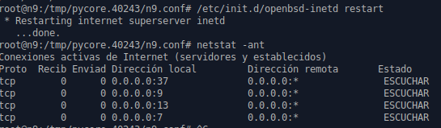
Está escuchando en los puertos correctamente

---

## c) Desde el nodo n13 realizar una conexión TCP y enviar datos mediante un programa cliente de su elección al servicio discard, y al echo. Capturar el tráfico con la herramienta tcpdump o wireshark y analizar la cantidad de segmentos, los flags utilizados y las opciones extras que llevan los encabezados tcp.

### Host n13
Utilizando nc para enviar datos:

 #### servicio echo
- `nc 200.5.59.194 7` -> conexión al puerto 7 (servicio echo)
Luego enviamos un mensaje
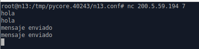
    Vemos que devuelve el mismo mensaje
Por último cerramos la conexión (CTRL+C)

Capturando el tráfico en n9 con Wireshark podemos observar:
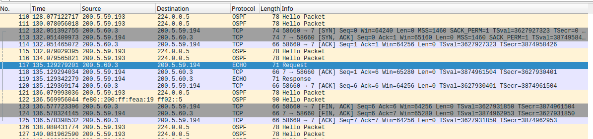
- **Cantidad de segmentos:** se observan 3 segmentos para la apertura de la conexión (112, 113 y 114) donde se produce el three way handshake, 4 segmentos para el envío y recepción de datos bidireccional (echo request 117, 118 y response 119, 120), y 3 segmentos para el cierre de la conexión (123, 124, 125)
- **Flags utilizados:**
    - **SYN**: se utiliza al iniciar la conexión
    - **ACK**: indica la confirmación de recepción de segmentos, aparece en casi todos los segmentos
    - **PSH**: indica que el segmento contiene datos a entregarse, utilizado en el envío y recepción de datos
    - **FIN**: se utiliza al cerrar la conexión, cada extremo envía un FIN
- **Opciones extra:** En los primeros dos segmentos, se observan
    - **Maximum segment size**: indica el maximo tamaño de datos (payload) que se puede recibir en un segmento
    - **SACK permitted**: Selective Acknowledgment, indica que ambas partes lo soportan, permite recuperar pérdidas sin reenviar todos los datos intermedios
    - **Timestamps**: incluye 2 valores: TSval (timestmap del emisor) y TSecr (echo del timestamp recibido)
    - **Window scale**: permite aumentar el tamaño de ventana mas allá del limite de 65.535
    - **NOP**: este aparece en los demás encabezados también, simplemente está de relleno, no hace nada

#### servicio discard
- `nc 200.5.59.194 9` -> conexión al puerto 9 (discard)
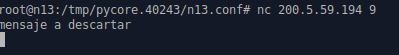
    Vemos que no devuelve nada (lo descarta)

Capturando el tráfico en n9 con Wireshark podemos observar:
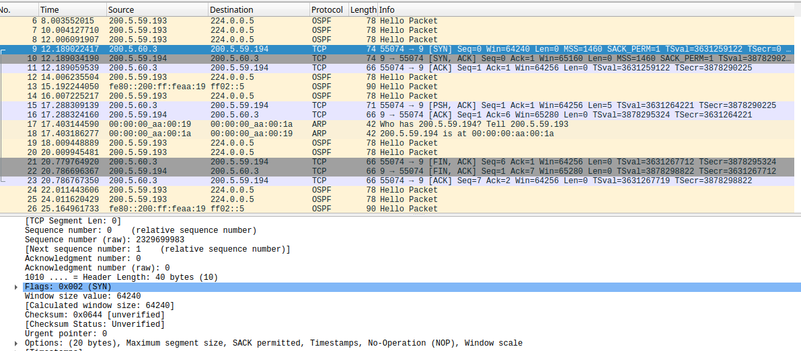
- **Cantidad de segmentos:** 3 para el inicio de la conexión (igual que el echo) 3 way handshake, 2 para el envío de datos y el discard (15, 16), ya que el servidor no le vuelve a enviar el mensaje, y solo lo descarta y le envía su ACK, y 3 para el cierre al igual que el echo.
- **Flags utilizados:** Los mismos que el anterior para cada caso.
- **Opciones extra:** Las mismas que el anterior.

## d) Sin cerrar las conexiones chequear los servicios activos y ver los Estados.

### Host n13
- Estableciendo las conexiones con los servicios echo y discard en dos terminales diferentes:
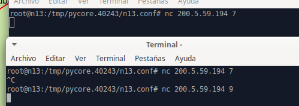

### Host n9 (servidor)
- Vemos el estado de los servicios:
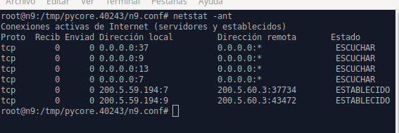

Podemos ver que los servicios activos correspondientes a Echo y Discard presentan estado "establecido".

## e) Generar nuevas conexiones hacia el nodo n9 e inspeccionar los estados. Por ejemplo realizar varias conexiones simultáneas al servicio tcp echo desde el mismo origen y desde otros nodos.

### Generando varias conexiones simultáneas al servicio echo
#### Host 13:
- Desde el mismo host, generamos 3 conexiones al mismo servicio echo:
    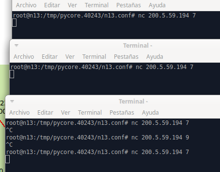
    Luego chequeamos los estados:
    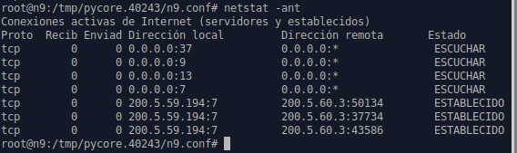
    Podemos ver que se muestran las nuevas conexiones correspondientes, con la misma dirección IP de host remota para el cliente (lo cual tiene sentido) pero diferente puerto efímero (puerto aleatorio alto, asignado aleatoriamente por el OS)

- Ahora, generando 3 conexiones desde diferentes hosts, en este caso host 13, 11 y 14:
    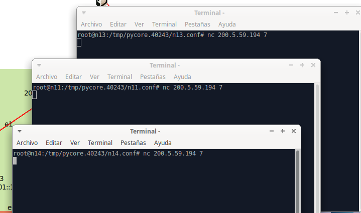
    Luego chequeamos los estados:
    
    Podemos ver que se muestran las nuevas conexiones correspondientes, pero esta vez con diferente dirección IP de host remota para cada nodo.

    
## f) Intentar generar conexiones a un puerto donde no existe un proceso esperando por recibir datos. ¿Cómo notifica TCP de este hecho (ver flags)?

### Intentando conexión desde n13 hacia 12345 de n9
Dado que el puerto 12345 no está escuchando:
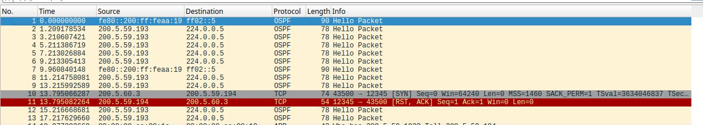

En la captura se observa SYN del cliente y, dado que no existe proceso escuchando en el destino, el host responde con RST,ACK (reset). Esta es la notificación estándar de TCP para “puerto cerrado” (connection refused).

## g) Cerrar las conexiones y ver el estado de los servicios en ambos lados. ¿En qué estado queda el que hace el cierre activo?

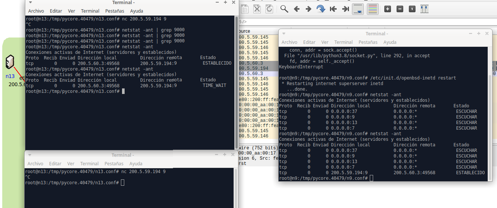

Al cerrar la conexión TCP desde el nodo n13 (cierre activo), se observa mediante netstat que dicho nodo queda en estado **TIME_WAIT**, mientras que el servidor (n9) pasa por los estados **CLOSE_WAIT y LAST_ACK** hasta finalizar la conexión. 
El estado TIME_WAIT permite asegurar el cierre correcto de la conexión y evitar la reutilización prematura de la tupla TCP.
Los estados CLOSE_wAIT y LAST_ACK no se llegan a observar debido a que su transición ocurre muy rapidamente cuando se cierra la conexión

## h) Observando la captura indicar la cantidad de segmentos y los flags utilizados. ¿Con cuántos segmentos se cerró la conexión? ¿Existen otras variantes de cierre?

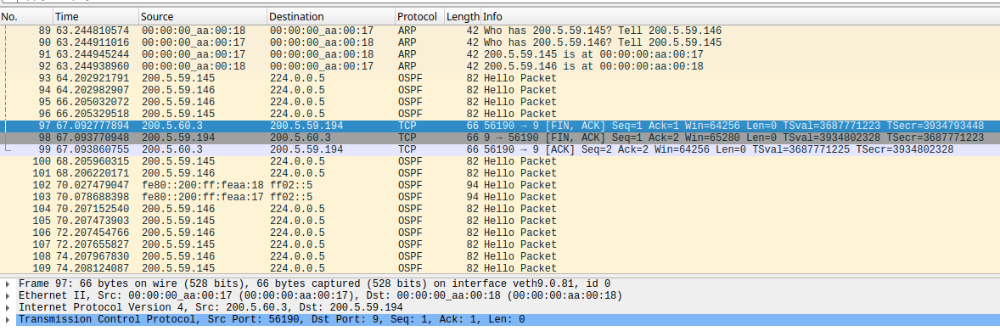

En la captura se observa un cierre TCP normal (4-way handshake, los ultimos 2 se juntan en uno) realizado mediante tres segmentos, protagonizados por los siguientes flags: FIN,ACK (paquete 97) – FIN,ACK (paquete 98) – ACK (paquete 99). Esto corresponde a un cierre ordenado donde el extremo pasivo cierra inmediatamente la conexión.
Existen otras variantes de cierre, como el **cierre en cuatro segmentos** (FIN–ACK–FIN–ACK), que ocurre cuando el segundo extremo **no cierra inmediatamente la conexión**, o el **cierre abrupto** mediante RST, que se usa ante errores, no hay handshake y la conexión termina inmediatamente.

## i) Hacer un diagrama de los segmentos intercambiados con los números de secuencia absolutos para una de las sesiones TCP (Se puede usar la herramienta wireshark u otra).

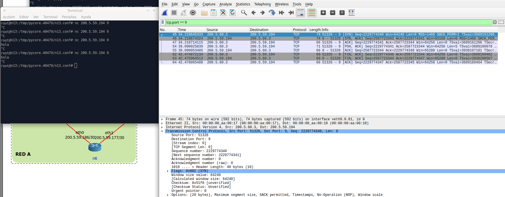

Se capturó una sesión TCP completa utilizando Wireshark en el router n8.
Se deshabilitó la opción "números de secuencia relativos", se identificaron los números de secuencia absolutos intercambiados durante el establecimiento, transferencia de datos y cierre de la conexión.
En base a los numeros de secuencia (Sequence number y Acknowledgment number) se realizó el diagrama, que muestra el three-way handshake, el intercambio de datos y el cierre ordenado de la sesión TCP.

Cliente (n13)                                        Servidor (n9)
    |                                                     |
Seq=2229774340  SYN  -----------------------------------> |
    |                                                     |
    | <------------------------------------  SYN,ACK   Seq=2587723343  Ack=2229774341
    |                                                     |
Seq=2229774341  Ack=2587723344  ------------------------> |  ACK
    |                                                     |
Seq=2229774341  Ack=2587723344  PSH,ACK (len=5) --------> |
    | <------------------------------------  PSH,ACK   Seq=2587723344  Ack=2229774346
    |                                                     |
Seq=2229774346  Ack=2587723344  FIN,ACK ----------------> |
    | <------------------------------------  FIN,ACK   Seq=2587723344  Ack=2229774347
Seq=2229774347  Ack=2587723345  ------------------------> |  ACK
    |                                                     |

## j) Alternativo: Realizar una conexión mediante nc indicando un puerto específico para el cliente. Luego cerrar la conexión desde el cliente e intentar abrirla nuevamente. ¿En qué estado está el socket? Investigar valor del 2MSL en la plataforma sobre la cual está haciendo los tests.

Primero abrimos una cinexión TCP de puerto fijo 

nc -p 50000 200.5.59.194 9

- -p 50000 → puerto origen fijo del cliente
- 200.5.59.194 → servidor (n9)
- 9 → puerto del servicio 

Luego cerramos la conexión desde n13, y observamos que el estado del socket queda en TIME_WAIT
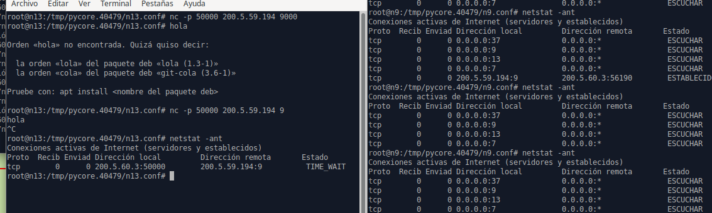

Al intentar abrir una conexión nueva, se muestra un error "Address already in use".
Esto es porque el socket (IP_origen, puerto_origen, IP_destino, puerto_destino) sigue reservado mientras está en TIME_WAIT.
TCP no permite reutilizarlo inmediatamente, esto evita recibir segmentos viejos y confundir conexiones nuevas con anteriores.
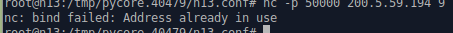

Para investigar 2xMSL ejecutamos el comando:

sysctl net.ipv4.tcp_fin_timeout
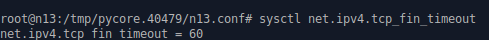

Este es el tiempo asociado a la reserva del socket, en este caso se muestra 60, que equivale a 60 segundos.

