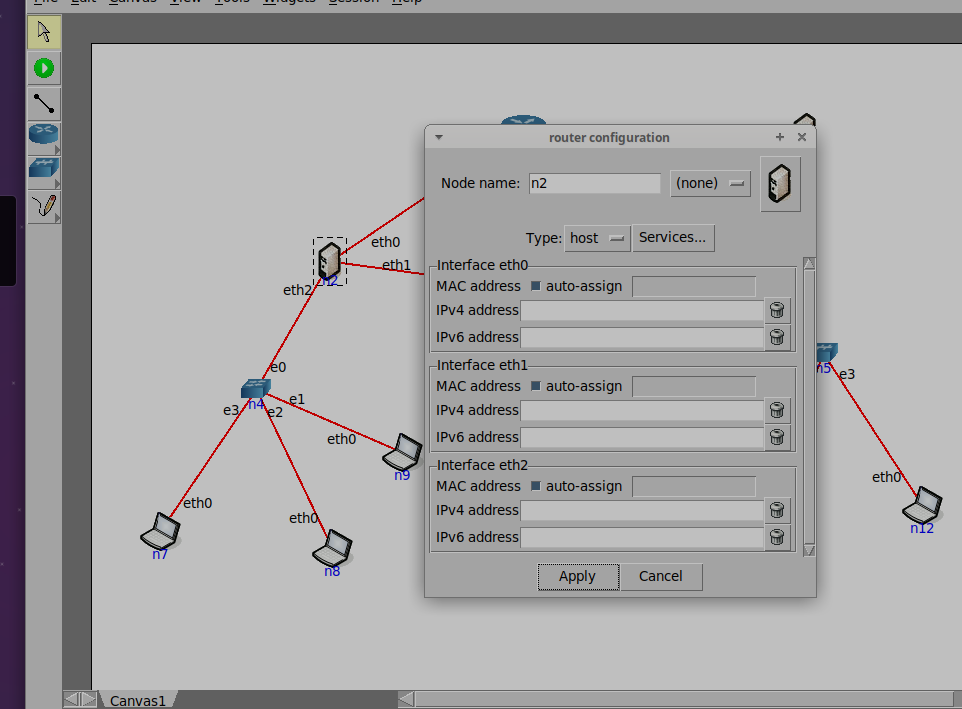

# Ejercicio 18

## Utilizando la herramienta CORE indicada por la cátedra, configurar el ruteo estático en la red que se muestra en el gráfico a continuación (fig. 2):

---

### Configuración de rutas por default en los routers
### (IP_FORWARD y RP_FILTER)
#### Ejemplo Configuración de Router "n2"

Sin ejecutar la topologia, asignaremos las IP correspondientes a las Interfaces del gráfico

Luego, configuraremos las rutas estáticas, seleccionamos el router con click derecho y elegimos la opción "services..."
Para este caso dejamos marcadas las siguientes opciones

Ahora abrimos las configuraciones de "StaticRoute", donde debemos colocar las direcciones que tendrá la tabla de ruteo del router seleccionado. Además de deshabilitar la opción "rp_filter" como lo indica el enunciado.

Por útimo aplicamos los cambios y guardamos la topología para que no se pierdan los cambios al salir.

##### Alternativas por consola UNA VEZ INICIADA LA VIRTUALIZACIÓN
#### ATENCIÓN (estas solo durarán lo que dure la sesión)

**IP_FORWARD**
Para **obtener** el valor, ejecutar:
    cat /proc/sys/net/ipv4/ip_forward o sysctl net.ipv4.ip_forward
Para **cambiar** el valor, ejecutar:
    sysctl net.ipv4.ip_forward=1

**RP_FILTER**
Para **obtener el valor**:
    sysctl net.ipv4.conf.all.rp_filter 
Para **cambiar** el valor:
    sysctl net.ipv4.conf.all.rp_filter=1

Para ambas configuraciones, 0 es deshabilitado, 1 habilitado.

--------

### Configuración de IPs según el gráfico:

✅ 1. **Configurar una dirección IP**

    sudo ifconfig eth0 192.168.1.10 netmask 255.255.255.0

    Esto asigna a eth0:

        IP → 192.168.1.10

        Máscara → 255.255.255.0

Podemos ver que según el gráfico tendrán la misma máscara

------------------

#### Verificación de tabla de ruteo

Ejecutamos la topología y una vez iniciada (todos los dispositivos deben mostrar el color verde), hacemos doble click sobre el router "n2" para abrir la terminal perteneciente a él. También es posible abrir la terminal haciendo click derecho -> Shell window -> bash.

Colocamos el comando `route -n`. Deberá aparecernos la ruta por default con la dirección IP de router "n3"

-------------------

### Verificación de conectividad entre las PCs

En este caso hacemos el ejemplo entre las PCs "n9" y "n12"

--------------

#### Comando PING

En CORE, el comando ping funciona exactamente igual que en cualquier Linux, porque cada nodo es un contenedor Linux real.

✅ 1. **Ping básico**
    ping 10.0.0.1

Esto envía paquetes ICMP “echo request” hasta que lo detengas con Ctrl + C.

✅ 2. Ping con **cantidad de paquetes**

CORE (al ser Linux) usa -c:

    ping -c 4 10.0.0.1

Envía solo 4 paquetes y termina.

✅ 3. Ping especificando **interfaz**
Útil cuando un router tiene varias interfaces:

    ping -I eth1 192.168.2.1

✅ 4. Ping con **tamaño de paquete**
    ping -s 1000 10.0.0.1

----------------
🧠 Tips útiles en CORE

✔️ Ver IPs del nodo antes de hacer ping
    ifconfig

✔️ Ver tabla de rutas del nodo
        route -n

    o moderno:
        ip route

✔️ Ver ARP (si falla el ping)
        arp -n

------------
--------------------------

**Continuando** Abrimos la terminal de la PC "n9" y colocamos `ping <ip_destino>`.

Para nuestro caso `ping 10.0.5.22`, ya que queremos comunicarnos con la PC "n12".

---

#### Comando TRACEROUTE

Abrimos la terminal de la PC "n9" y colocamos 

`traceroute <ip_destino>`.

Para nuestro caso `traceroute 10.0.5.22`, ya que queremos comunicarnos con la PC "n12".

--------------------

#### Comando PING -NR

#### 🟦 1) ¿Qué hace ping -nr?

En realidad, no existe un flag -nr como uno solo.
Son dos flags separados:

    ping -n
    ping -r

Y cada uno hace algo distinto.

**✔️ ping -n**
Muestra las direcciones **sin resolver DNS**.
Es decir, no intenta convertir las IP en nombres.

Ejemplo:

    ping -n 8.8.8.8

    → Solo muestra “8.8.8.8”, nunca “dns.google”.

**✔️ ping -r**
Este es más interesante: **bypassea la tabla de ruteo**.
Significa:
“No uses la tabla de rutas, enviá el paquete directamente por una interfaz conectada a esa red”.

Esto solo funciona si el destino está en la misma red física.Si no, falla.

Ejemplo:

    ping -r 192.168.1.25

    Tu máquina intentará enviar el paquete sin consultar rutas estáticas ni default gateway.

👉 Útil en CORE para:

- Ver si hay conectividad L2 incluso sin rutas
- Probar si el enlace está vivo
- Ver si ARP funciona

👉 NO funciona para redes remotas.

Abrimos la terminal de la PC "n9" y colocamos `ping -nR <ip_destino>`.

Para nuestro caso `ping -nR 10.0.5.22`, ya que queremos comunicarnos con la PC "n12".

----------------

#### Comando TRACEROUTE -I

Muestra el tamaño del paquete enviado

Abrimos la terminal de la PC "n9" y colocamos `traceroute -I <ip_destino>`.

Para nuestro caso `traceroute -I 10.0.5.22`, ya que queremos comunicarnos con la PC "n12".

---

#### Comando MTR

Muestra en una sola pantalla:
- Los saltos de red (como traceroute)
- La latencia promedio
- La pérdida de paquetes en cada salto
- Estadísticas que se actualizan en tiempo real

El comando `mtr <ip_destino>` daba un error pero se solucionó agregando el parámetro "-r" para visualizar la información en modo de reporte. También puede agregarse el parámetro "-c <cantidad_de_ping>" , para indicar cuántos ping queremos hacer entre cada salto al llegar a un dispositivo.

Abrimos la terminal de la PC "n9" y colocamos `mtr -r <ip_destino>`.

Para nuestro caso `mtr -r 10.0.5.22`, ya que queremos comunicarnos con la PC "n12".

Si quisiéramos agregar la cantidad de ping realizados entre cada salto como se mencionó anteriormente, el comando sería: 
`mtr -r -c 3 10.0.0.5.22`. 
Acá estamos indicando que queremos visualizar la información en **modo de reporte** y que además se realicen **3 ping entre cada salto**.

---

### Análisis de tráfico en router intermedio

#### Captura del tráfico en Router "n2"

Primero hacemos un ping desde la PC "n9" hacia la PC "n12".

Luego desde la terminal de Router "n2" utilizamos el comando `tcpdump -i <interfaz_router>`.

En nuestro caso vamos a probar las 3 interfaces. Entonces deberíamos colocar:

- `tcpdump -i eth0`
- `tcpdump -i eth1`
- `tcpdump -i eth2`

Como era de esperar:
- eth1: escucha los Echo Request (el mensaje va)
- eth0: escucha los Echo Reply (el mensaje vuelve)
- eth2: escucha ambos (va y vuelve, pues está en su subred)

---

## Si la estación PC n7 le envía un ping a la estación PC n6:

### ¿Cuál es el camino por el que viaja el requerimiento?¿Cuál es el camino por el que viaja la respuesta?

Verificando con el comando **traceroute**, se obtienen los siguientes caminos:

- IDA: n7 → 10.0.4.1 → 10.0.2.2 → 10.0.1.2 → n6
- VUELTA: n6 → 10.0.1.2 → 10.0.2.2 → 10.0.4.1 → n7

---

## Mantenimiento de la red
### Suponiendo que en el Router n1 se agregó una interfaz de red con la dirección IP 163.10.10.1/24:

### Identifique los cambios que deberían ser necesarios al ruteo estático para que todas las PCs puedan comunicarse con hosts en la nueva red.

#### Routers que NO son n1
Tienen que **saber llegar a 163.10.10.0/24**.
Hay que **agregar una ruta estática** específica **apuntando a n1 como next-hop** por el enlace que los une con n1.

**Router n2 (vía el enlace n2–n1):**
    # usando 'ip' moderno
    ip route add **163.10.10.0/24** via <**10.0.1.2**>

    # o con net-tools
    route add -net 163.10.10.0 netmask 255.255.255.0 gw <10.0.1.2>

**Router n3 (vía el enlace n3–n1):**
    ip route add **163.10.10.0/24** via <**10.0.2.1**>
    # o
    route add -net 163.10.10.0 netmask 255.255.255.0 gw <10.0.2.1>

**Router n1**
Para que esa red responda al resto, **alcanzan las rutas por defecto existentes**:

- ip_forward=1 en n1.
- En los hosts de 163.10.10.0/24, gateway 163.10.10.1.

**PCs**
No cambian sus rutas

### En base a lo anterior, ¿qué puede decir respecto del mantenimiento del ruteo en una red que tiene más de 20 routers?

En el caso de agregar más routers dentro de la topología **deberíamos repetir el proceso de ruteo estático por cada uno**, lo que dificultaría el proceso a medida de que aumentamos la cantidad. **Lo recomendable en estos casos**, es requerir a métodos como **ruteo dinámico**.

---

## ICMP y RUTEO 1: Desde la PC n6, realice un ping a la dirección IP 5.5.5.5

### ¿Qué indica el mensaje de error recibido?, ¿Quién lo envía?

El mensaje “**Time to live exceeded**” indica que el paquete ICMP enviado al destino 5.5.5.5 **nunca llegó**, porque fue descartado en el camino al agotarse el campo **TTL (Time To Live)**. Esto ocurre porque **no existe una ruta hacia 5.5.5.5** en la tabla de ruteo, por lo que los routers reenvían el paquete de manera cíclica hasta que el TTL llega a 0 y el paquete es descartado.

El mensaje de error es enviado por el **Router "n1"** (10.0.0.1), que es el **último router en recibir el paquete** antes de descartarlo.
Cada vez que el TTL llega a 0, el router que detecta la expiración es el encargado de enviar el mensaje ICMP Type 11 (Time Exceeded) de vuelta al emisor (PC n6 en este caso).

---

## ICMP y RUTEO 2: Desde la PC n6, realice un ping a la dirección IP 10.0.5.23

### ¿Qué indica el mensaje de error recibido?, ¿Quién lo envió?

El mensaje de error **"Destination Host Unreachable"** indica que el host de destino (10.0.5.23) es inalcanzable porque **no responde en la red local, aunque la red sí es conocida**. El mensaje **lo envía el router 10.0.2.2**, que es el **gateway** (o puerta de enlace) hacia esa red y que, **tras fallar la resolución ARP, notifica al emisor**.

---

## ICMP y RUTEO 3: Provoque un loop de enrutamiento entre los routers con una nueva red, por ejemplo la red 200.100.11.0/24 y luego desde la PC n6, realice un ping a la dirección 200.100.11.5

### ¿Qué indica el mensaje de error recibido?, ¿Quién lo envía?

Sucede lo mismo que para el caso del inciso "ICMP y RUTEO 1", solo que en esta ocasión el que reenvía el mensaje de error es el gateway perteneciente a la red del host "n6".